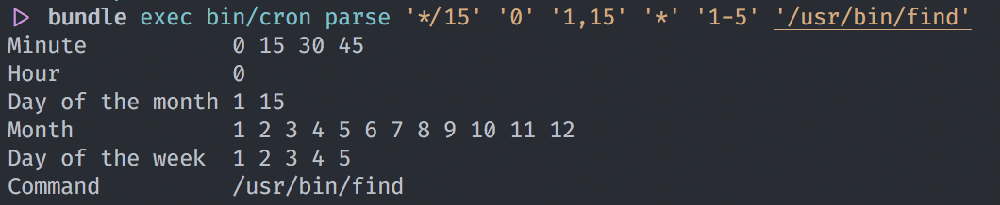

# Cron

## Requirements
Ruby - I used ruby 2.6.3
Bundler - 2.0.1

## Run the project

Once in the project folder, run: 
```
bundle install
```

Once all the required gems are installed, you can run the project with:


```sh
bundle exec bin/cron parse '*/15' '0' '1,15' '*' '1-5' '/usr/bin/find'
```

## Run the specs

```sh
bundle exec rspec
```

## Example Result


